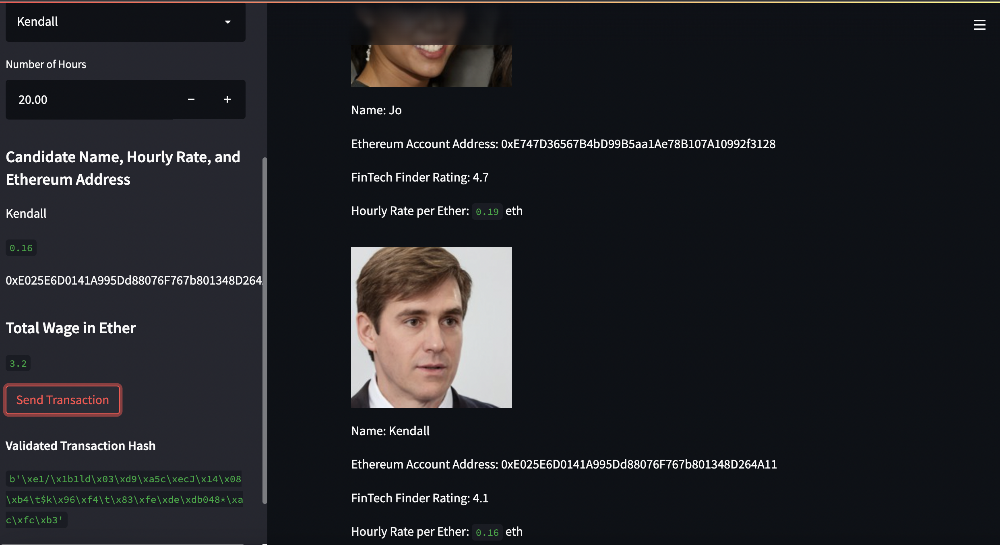

# Ethereum Blockchain Wallet


The goal of these Python files is to create an application named "Fintech Finder" that customers can use to find fintech professionals from among a list of candidates, hire them, and pay them using the Ethereum blockchain network. This will allow customers to instantly pay the fintech professionals whom they hire with cryptocurrency. 

---

## Technologies 
In addition to the standard Python 3.7 dev libraries, this file leverages the following libraries and/or dependencies:
* [Web3.py](https://web3py.readthedocs.io/en/stable/overview.html) - A Python library for connecting to and performing operations on Ethereum-based blockchains
* [bip44](https://pypi.org/project/bip44/) - A Python implementation for deriving hierarchical deterministic wallets from a seed phrase based on the BIP-44 standard
* [Ganache](https://trufflesuite.com/ganache/) - A program that allows you to quickly set up a local blockchain, which you can use to test and develop smart contracts
* [Streamlit](https://streamlit.io/) - Turns data scripts into shareable web apps using Python
* [dotenv](https://pypi.org/project/python-dotenv/) - Python-dotenv reads key-value pairs from a .env file and can set them as environment variables
* [dataclasses](https://docs.python.org/3/library/dataclasses.html) - A decorator that is used to add generated special methods to classes
* [typing](https://docs.python.org/3/library/typing.html) - Provides runtime support for type hints
* [requests](https://pypi.org/project/requests/) - A simple, yet elegant, HTTP library. Allows you to send HTTP/1.1 requests extremely easily

### Imports
Imports for `crypto_wallet.py` file: 
```
import os
import requests
from dotenv import load_dotenv
load_dotenv()
from bip44 import Wallet
from web3 import Account
from web3 import middleware
from web3.gas_strategies.time_based import medium_gas_price_strategy
```
Imports for `fintech_finder.py` file: 
```
import streamlit as st
from dataclasses import dataclass
from typing import Any, List
from web3 import Web3
```
Ganache network: w3 = Web3(Web3.HTTPProvider('HTTP://127.0.0.1:7545'))

---

## Installation Guide
If you do not already have the required **technologies** installed, install them now through your terminal.
For example:
```
pip install streamlit
pip install web3==5.17
pip install bip44
pip install dataclasses
```

If you do not already have Ganache, download and install the lastest version of Ganache [here](https://trufflesuite.com/ganache/). 
To create a workspace, click on "Quickstart Ethereum".

---

## Usage
To interact with this file and open your own streamlit web interface using the streamlit code written in `fintech_finder.py`:
1. Fork the repository
2. Clone the forked repository to your local machine `git clone <repo_name>`
3. Open Ganache and copy the mnemonic found at the top of your Ganache application and paste it into the ".env" file
`MNEMONIC = '<paste your mnemonic here>'`
4. Open your terminal and change your current working directory to the location where these files are stored
5. Activate the environment and launch streamlit:
    ```
    conda activate dev
    streamlit run fintech_finder.py
    ```

Instructions for using the Streamlit application:
*See example screenshot of the app below*
1. Review the fintech professionals' bios, which includes their ratings and hourly rates in Ether   
2. Select a Person from the drop-down menu 
3. Type in or use the +/- arrows to indicate how many hours you want to hire the person for
4. Press the "Send Transaction" button to pay the professionals their earned wages in Ether
5. Review the Validated Transaction Hash 
6. On Ganache, check your account balance and click on the "TRANSACTIONS" tab to review the transactions you made via Streamlit

---

## Methods
1. Create `crypto_wallet.py` file that contains the Ethereum transaction functions (i.e., generate account, get balance, send transaction)
2. Create the `fintech_finder.py`. Import the functions from the `crypto_wallet.py` file. Add the candidate information to streamlit, and add streamlit functionality that allows a customer to sign and execute a payment transaction
3. Inspect the transaction by reviewing the validated transaction hash and reviewing the transaction in Ganache

---

## Results - Streamlit Application
For examples of the streamlit application in action, check out these screenshots.

### App Overview 
Here is an example of the drop-down menu for choosing a fintech professional: 


Here is an example of choosing the number of hours that you want to hire the professional for:


Here is an example of a transaction that was sent to Kendall for his 8 hours of work:


### Ganache Connection
Here is an example of the Ganache account balance; the transaction paid Kendall the 1.28 Ether he was owed:


Here is an example of 
---

## Contributors
Catherine Croft

Email: catherinecroft1014@gmail.com

LinkedIn: [catherine-croft](https://www.linkedin.com/in/catherine-croft-4715481aa/)

---

## License 
MIT